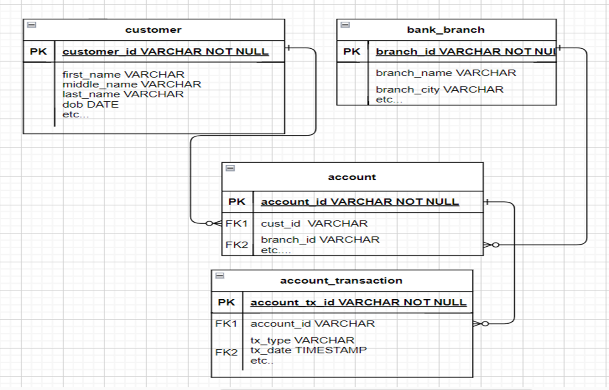

# realtime-project
A Bank Application - Spring BOOT WebFlux(Web Reactive) Application,
Enforced Spring Transaction Manager for Concurrency Control

-  Prereq: Java 18 or higher, IntelliJ/Eclipse
-  Please create a dir in your C/D/E drive (D:/test/bank-db) or your /path/to/folder
-  Update path in dbserver/RunDBServer.java, uses H2 in server mode, start java DB server
-  DB access url: http://localhost:8082
-  BankApplication.java start the server app
-  Base URL: http://localhost:10000/bank-app
- # Bank Branch Rest API
  - Get all branches: http://localhost:10000/bank-app/getAllBranches
  - Get branch by id: http://localhost:10000/bank-app/getBranchById/{id}
  - create a branch via POST data: http://localhost:10000/bank-app/createBranch
- # Account Rest API
  - Get all accounts: http://localhost:10000/bank-app/getAllAccounts
  - Get account by id: http://localhost:10000/bank-app/getAccountById/{id}
  - create a account, using customer,branch via POST data: http://localhost:10000/bank-app/createAccount
- # Customer Rest API
  - Get all customers: http://localhost:10000/bank-app/getAllAccounts
  - Get customer by id: http://localhost:10000/bank-app/getCustomerById/{id}
  - create a customer via POST data: http://localhost:10000/bank-app/registerCustomer
- # Account Transaction Rest API
  - Get all account trxns: http://localhost:10000/bank-app/getAllAccountTrxns
  - Get account trxn by id: http://localhost:10000/bank-app/getAccountTrxnById/{id}
  - create a account trxn, using account via POST data: http://localhost:10000/bank-app/createAccountTrxn
- # Database Design Model
